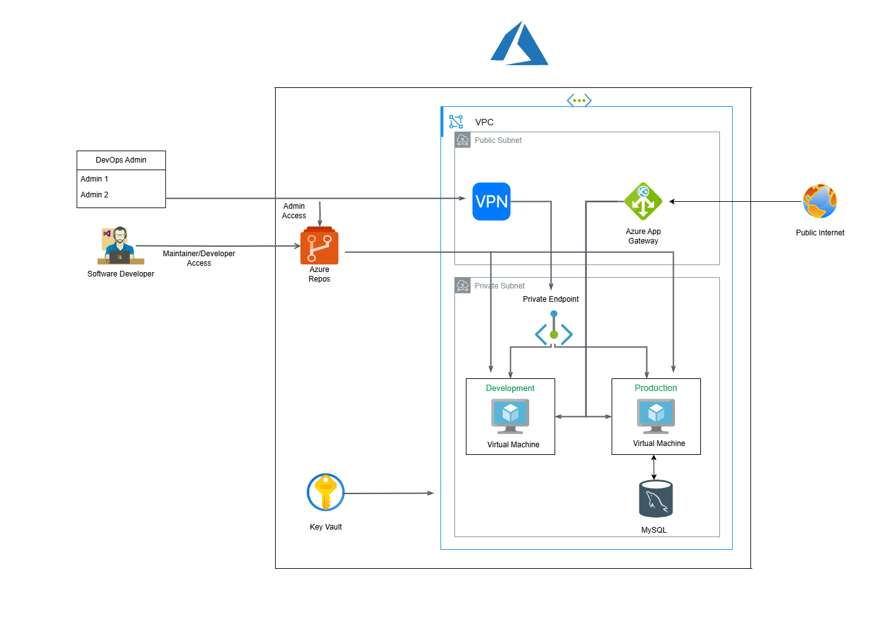

```mermaid
flowchart TB
    %% Azure cloud setup
    subgraph AzureCloud["Azure Environment"]
        AzureRepos["Azure Repos"]
        AzurePipelines["Azure Pipeline"]
        ACR["Azure Container Registry (ACR)"]
        KeyVault["Azure Key Vault"]
    end

    %% Virtual Network (VPC) structure
    subgraph VNet["Virtual Network (VPC)"]
        VPN["VPN Gateway"]
        
        subgraph AKSCluster["AKS Cluster"]
            NodePool["Node Pool"]
            ProdNamespace["Prod Namespace"]
            DevNamespace["Dev Namespace"]
            ProdNamespace --> Pod1["Pod"]
            DevNamespace --> Pod2["Pod"]
        end
        
        LoadBalancer["Load Balancer"]
        AppGateway["Azure App Gateway"]
        PostgreSQL["PostgreSQL Database"]
    end

    %% User access
    SoftwareDeveloper["Software Developer"]
    DevOpsAdmin["Gray Chain DevOps Admin"]
    Maintainer["Maintainer/Developer Access"]

    %% Connections with labels
    SoftwareDeveloper -->|Developer Access| AzureRepos
    DevOpsAdmin -->|Cluster Admin Access| AzureRepos
    AzureRepos --> AzurePipelines
    AzurePipelines -->|Deploy| ACR
    AzurePipelines -->|Secrets| KeyVault
    AzurePipelines -.->|Helm Chart| VPN
    VPN --> VNet
    VNet --> LoadBalancer
    LoadBalancer --> AppGateway
    AppGateway -->|SSL| PostgreSQL
    AKSCluster --> LoadBalancer
    PostgreSQL --> AKSCluster


